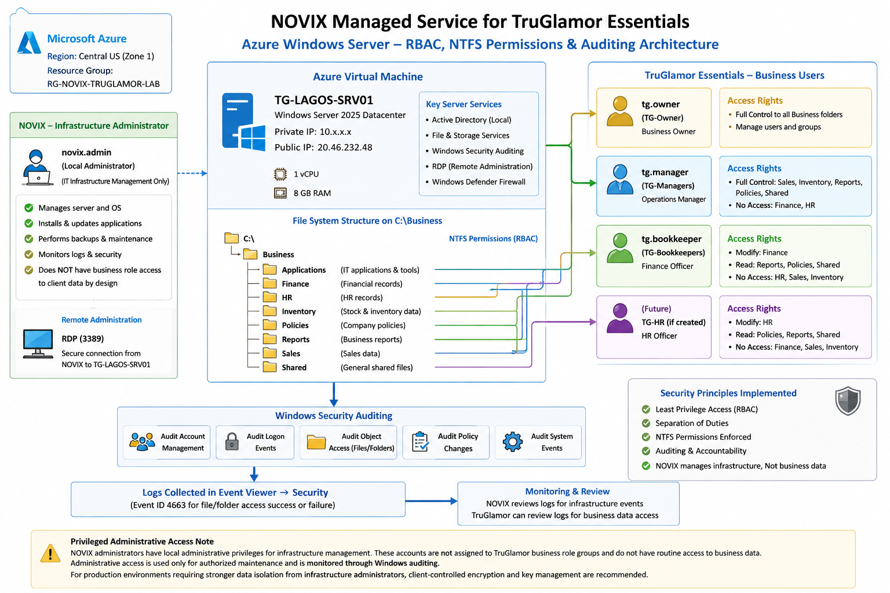
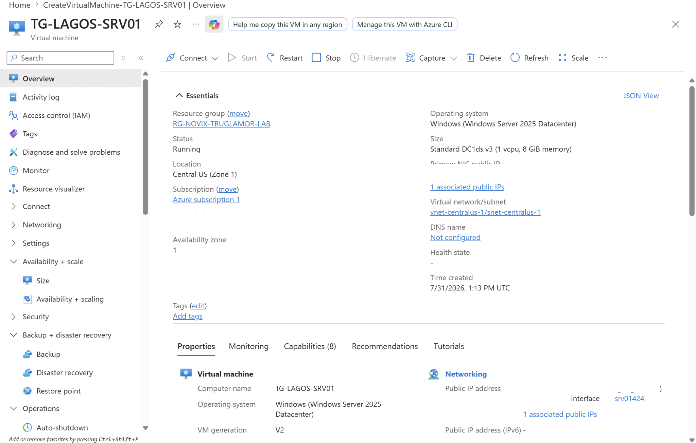
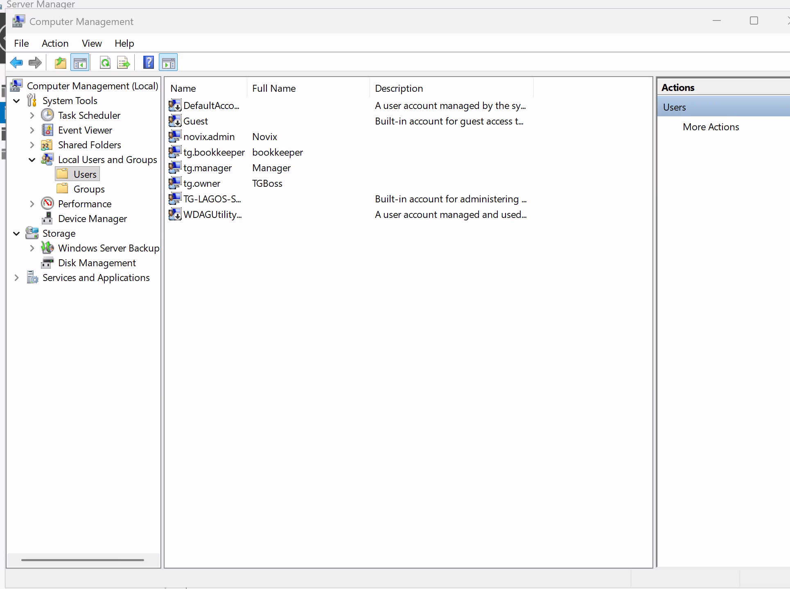
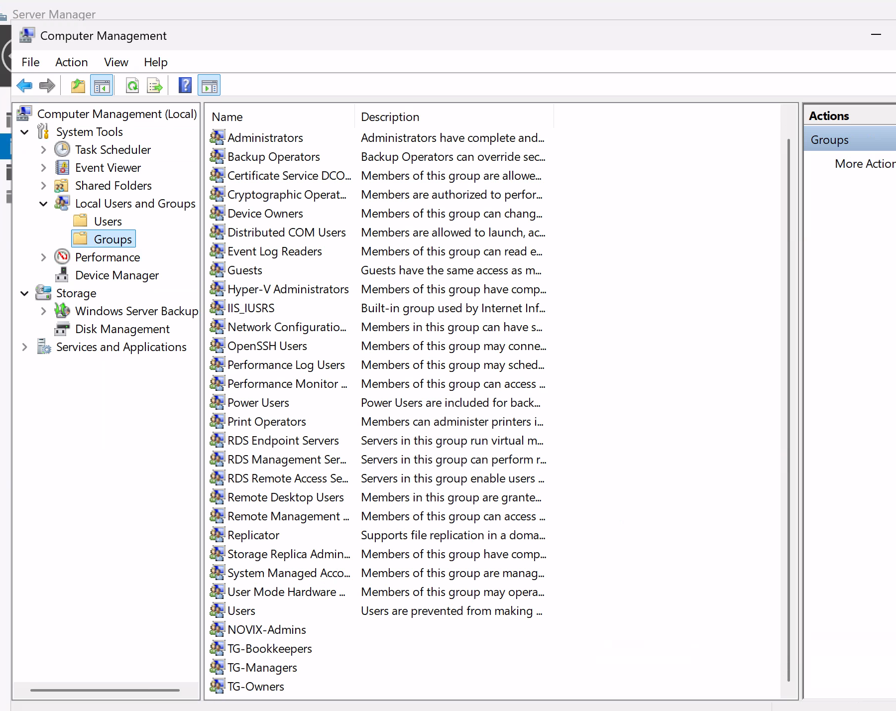
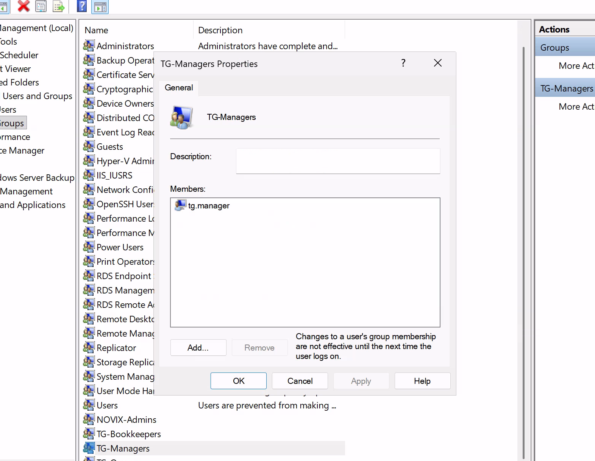
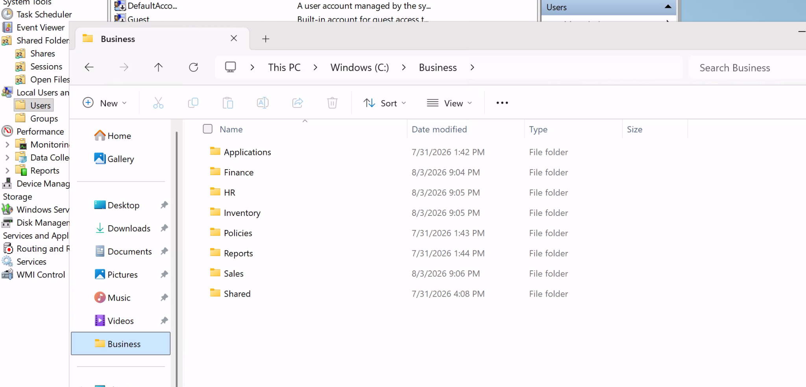
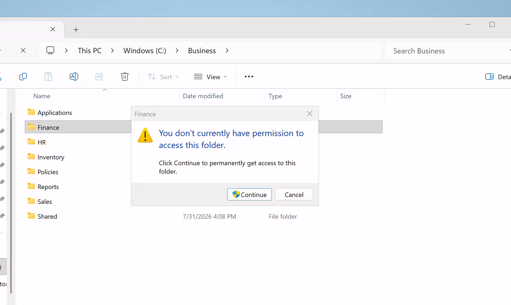
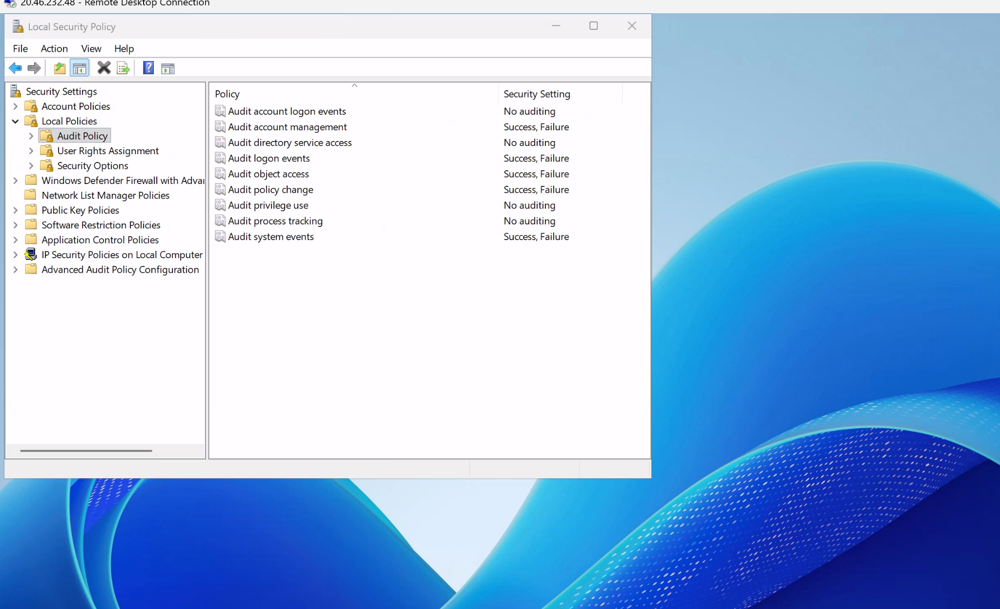
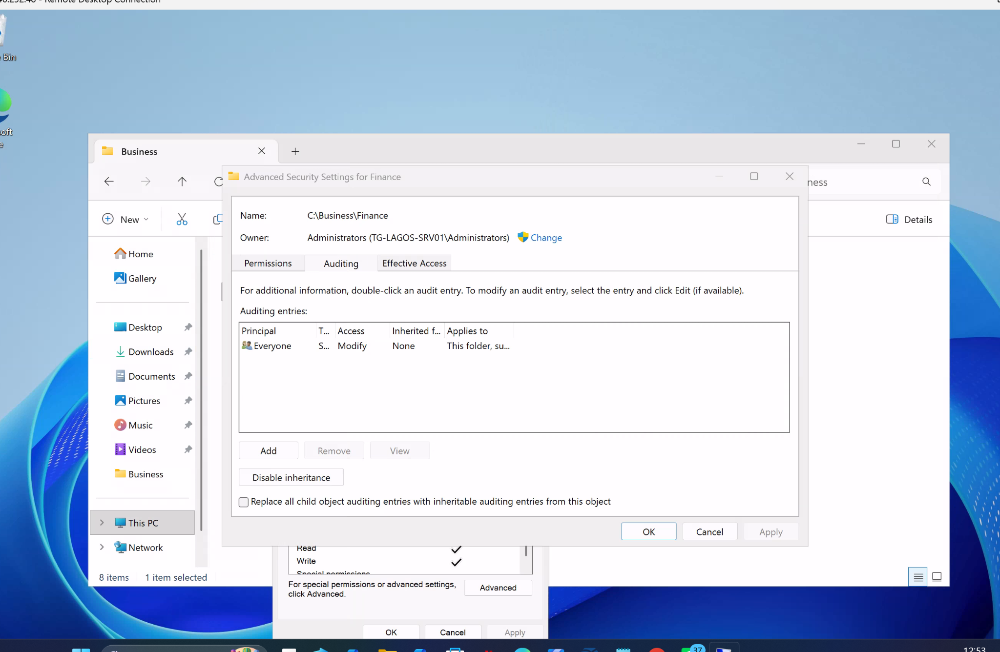
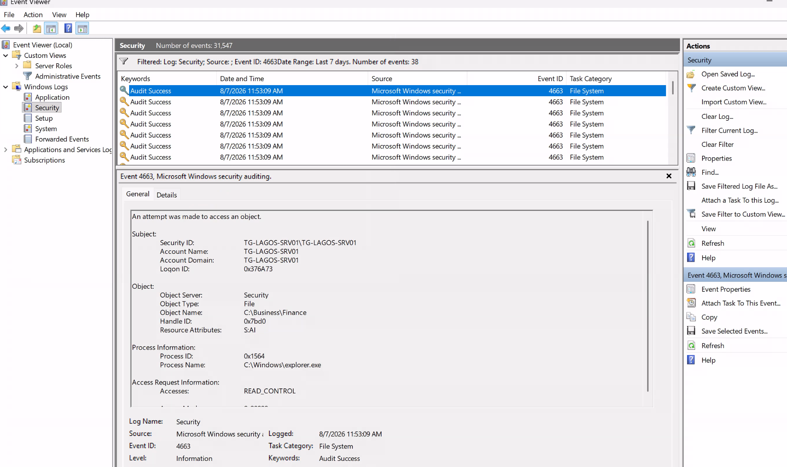

# azure-secure-business-infrastructure
Designed and implemented a secure Microsoft Azure Windows Server environment with role-based access control, least privilege, NTFS permissions, security auditing and access validation for a small-business use case.

# Secure Azure Business Infrastructure

## Project Overview

This project involved designing and implementing a secure cloud-hosted Windows Server environment in Microsoft Azure for a small-business use case.

The business required a centralised environment where authorised users could access operational information while ensuring that sensitive resources such as Finance, HR, Inventory and Sales were restricted according to staff responsibilities.

I implemented individual user accounts, role-based security groups, NTFS permissions and Windows security auditing to provide controlled access and improve accountability.

The environment was then tested using different user accounts to verify that authorised access was permitted, unauthorised access was denied, and relevant file-access activity could be identified through Windows Security logs.

This project focuses on the infrastructure and security controls required to support secure business operations. It is not intended to function as a complete fraud-prevention or business transaction monitoring system.

****

## Project Scenario

TruGlamor is a small business operating in Lagos, Nigeria, with management requiring the ability to oversee business resources remotely.

The environment needed to support different responsibilities across the business while reducing unnecessary access to sensitive information.

Three primary business roles were considered:

- **Owner** – broader access to business resources and management information.
- **Manager** – operational access based on management responsibilities.
- **Bookkeeper** – access to financial and other resources required for bookkeeping responsibilities.

NOVIX was responsible for infrastructure administration and security configuration.

---

## Technologies Used

- Microsoft Azure
- Windows Server 2025 Datacenter
- Azure Virtual Machines
- Windows Local Users and Groups
- Role-Based Access Control (RBAC)
- NTFS Permissions
- Windows Security Auditing
- Windows Event Viewer
- Remote Desktop Protocol (RDP)

---

## Solution Architecture

The solution uses a Microsoft Azure-hosted Windows Server as the central environment for business resources.

Individual user accounts are assigned to security groups based on job responsibilities. NTFS permissions are then applied to business folders to control which roles can access sensitive information.

Windows security auditing provides an additional layer of accountability by recording selected security and file-access activity for investigation.

### Security Design Principles

The implementation was based on the following principles:

- **Individual accountability** – each user has a separate account rather than using shared credentials.
- **Least privilege** – users receive only the access required for their responsibilities.
- **Role-based access** – permissions are assigned through security groups rather than directly to individual users where possible.
- **Separation of responsibilities** – business roles have different levels of access to Finance, HR, Inventory, Sales and other resources.
- **Auditing** – security events and selected file-access activity are logged to support investigation.
- **Administrative separation** – NOVIX manages the infrastructure but is not assigned to normal TruGlamor business-role groups.

### Business Architecture

This view shows how the solution supports TruGlamor's business operations and separates access according to staff responsibilities.

### Technical Architecture

This view shows the underlying Azure and Windows Server security implementation, including identity, role-based access control, protected business resources and security auditing.

---

## Technical Implementation

### 1. Azure Infrastructure

I deployed a Windows Server 2025 Datacenter virtual machine in Microsofft Azure to provide the central environment for the project.

The server was configured as:

- **Hostname:** TG-LAGOS-SRV01
- **Cloud Platform:** Microsoft Azure
- **Operating System:** Windows Server 2025 Datacenter
- **Region:** Central US
- **Remote Administration:** Remote Desktop Protocol (RDP)

The Azure VM provided the underlying infrastructure for user management, access control, business file storage and security auditing.

### 2. User Accounts

Separate Windows accounts were created so that activity could be associated with individual users rather than relying on shared credentials.

The main accounts used during the implementation were:

| Account | Role |
|---|---|
| `tg.owner` | Business Owner |
| `tg.manager` | Branch Manager |
| `tg.bookkeeper` | Bookkeeper |
| `novix.admin` | Infrastructure Administration |

### 3. Security Groups

Instead of assigning permissions individually to every user, I created security groups representing the different responsibilities within the environment.

These included:

- `TG-Owners`
- `TG-Managers`
- `TG-Bookkeepers`
- `NOVIX-Admins`

Users were assigned to the appropriate group based on their role.

This approach makes permission management easier to maintain and allows additional users to be added to a role without redesigning the folder permissions.

### 4. Business Folder Structure

A central business workspace was created under:

`C:\Business`

The workspace was divided into separate areas for:

- Applications
- Finance
- HR
- Inventory
- Policies
- Reports
- Sales
- Shared

Separating the information into different folders allowed permissions to be applied according to business responsibility.

### 5. Role-Based Access Control

NTFS permissions were configured on the business folders to enforce least-privilege access.

For example:

- The **Owner** received broader access to business information.
- The **Bookkeeper** received access to financial resources required for the role.
- The **Manager** received access to operational resources while access to sensitive Finance information was restricted.
- **NOVIX administration** was separated from normal business-role group membership.

Permissions were assigned primarily through security groups rather than directly to individual user accounts.

This made the access-control model easier to understand, test and maintain.

---

## Implementation Evidence

The following screenshots were captured during configuration and testing of the environment. Sensitive cloud identifiers have been removed before publication.

### Azure Infrastructure

The project environment was deployed on Microsoft Azure using a Windows Server virtual machine.

### Identity and Access Management

Individual Windows accounts and security groups were created to separate access according to business responsibilities.

The following screenshot demonstrates user membership within the appropriate role-based security group.

### Business Workspace

Business resources were separated into dedicated folders so that permissions could be applied according to operational responsibilities.

### Access Control Validation

Role-based permissions were tested using different user accounts. Unauthorized access to protected resources was denied as expected.

### Security Auditing

Windows security auditing was configured to record relevant security and object-access activity.

Folder-level auditing was also configured for sensitive business resources.

### Event Log Investigation

Windows Event Viewer was used to validate the audit configuration. Event ID `4663` provided evidence of monitored object-access activity.

---

## Security Testing and Validation

After configuring the environment, I tested the access-control model using the different user accounts to confirm that the permissions worked as intended.

### Access Control Testing

Testing was performed by signing in with different business accounts and attempting to access resources inside the `C:\Business` workspace.

The tests confirmed that users could access resources required for their roles while restricted resources remained inaccessible.

One example was the Manager account attempting to access the Finance folder. The account was denied access because Finance was outside the permissions assigned to the Manager role.

This helped verify that the NTFS permissions and security-group memberships were enforcing the intended access-control model.

### Security Auditing

Windows security auditing was configured to provide visibility into security-related activity.

The following audit categories were enabled for both successful and failed events:

- Account Management
- Logon Events
- Object Access
- Policy Change
- System Events

Folder-level auditing was also configured on selected business resources to record relevant access activity.

### Event Log Validation

I used Windows Event Viewer to review the Security log after generating file-access activity.

Event ID `4663` was used during validation to identify attempts to access objects within the monitored business folders.

The event information provided useful details such as:

- User/account involved
- Object or file accessed
- Type of access requested
- Process associated with the activity
- Timestamp of the event

This demonstrated that access controls could be combined with security auditing to provide both **restriction and traceability**.

---

## Validation Result

The testing demonstrated that:

- Role-based permissions were being enforced.
- Unauthorized folder access could be denied.
- Authorized users retained access to resources required for their roles.
- Security events were generated during monitored file activity.
- Event Viewer could be used to investigate access to protected resources.

The implementation therefore provided both preventative access controls and detective controls for the test environment.

---

## Security Findings and Limitations

Testing the environment highlighted several important security considerations.

### 1. Privileged Administrator Access

The business users were successfully restricted according to their assigned roles. However, Windows local administrators retain privileged control over the operating system.

Although the NOVIX administrative account was not assigned to TruGlamor business-role groups, an administrator can potentially modify NTFS permissions, take ownership of files, or perform other privileged actions when required for system administration.

This means that NTFS permissions provide effective separation between normal business users, but they should not be treated as a mechanism for completely isolating data from a privileged system administrator.

For this implementation, NOVIX administrative access is treated as infrastructure administration rather than routine authorization to access business information.

A production environment requiring stronger separation could introduce additional privileged-access controls and client-controlled encryption or key management.

### 2. Auditing Provides Evidence, Not Prevention

Windows security auditing improves visibility by recording selected user and system activity.

However, logging does not prevent an authorized user from intentionally misusing legitimate access.

For example, if a user is authorized to modify a financial document, Windows permissions cannot determine whether the business information entered into that document is accurate or fraudulent.

This project therefore provides access control and technical accountability rather than a complete fraud-prevention system.

### 3. Business Activity Outside the Server

The environment can monitor activity that occurs within the configured Windows infrastructure, but it cannot independently detect physical events such as:

- Unrecorded cash transactions
- Physical inventory theft
- Staff collusion
- Transactions performed outside approved systems

Addressing these risks would require additional business controls and transactional applications.

### 4. Proof-of-Concept Scope

The environment was built as a controlled implementation to demonstrate cloud infrastructure security, role-based access control and auditing.

Before production deployment, additional controls would be considered, including stronger identity protection, centralized monitoring, backup and recovery testing, privileged-access management and enhanced network security.

---

## Key Security Takeaway

One of the main lessons from this project was that access control and accountability are related but separate security problems.

---

## Lessons Learned

This project gave me practical experience moving from a security design to an implemented and tested environment.

### Design Before Configuration

Planning the user roles, security groups and folder structure before assigning permissions made the access-control model easier to manage and troubleshoot.

Using security groups rather than assigning permissions directly to individual users also made the design more scalable.

### Test Security Controls

Configuring a permission does not prove that it works.

Testing the environment using the Owner, Manager and Bookkeeper accounts helped identify permission issues and confirm the final access-control behaviour.

This reinforced the importance of validating security controls from the perspective of the user affected by them.

### Logging Needs Context

Enabling auditing generated a large number of Windows security events.

Filtering and investigating specific events, including Event ID `4663`, demonstrated that collecting logs is only the first step. Useful monitoring also requires knowing which events are relevant and what activity should be investigated.

### Administrative Privilege Requires Additional Controls

The project also demonstrated the difference between normal user access and privileged administrative access.

A system administrator may retain the technical ability to change permissions even when they are not assigned normal business-data access.

In a production environment, privileged access should therefore be tightly controlled, monitored and used only when required.

---

## Future Improvements

If this environment were developed further for production use, I would consider the following improvements:

- **Microsoft Entra ID integration** for centralized identity management.
- **Multi-Factor Authentication (MFA)** for administrative and remote access.
- **Privileged Access Management** to reduce standing administrative privileges.
- **Azure Monitor / Log Analytics** for centralized security monitoring.
- **Microsoft Defender for Cloud** for additional cloud security visibility and recommendations.
- **Automated backup and restore testing** to validate business continuity.
- **Stronger network controls** to reduce unnecessary exposure of remote administration services.
- **Client-controlled encryption/key management** where stronger separation between infrastructure administrators and business data is required.
- **Alerting rules** for suspicious authentication, permission changes and sensitive resource access.

A future phase could also introduce transaction-level business applications for sales, inventory and financial workflows. This would allow security monitoring to move beyond file access and provide greater visibility into business activity.

---

## Project Outcome

The project resulted in a working Azure-hosted Windows Server environment with:

- Individual user identities
- Role-based security groups
- Least-privilege NTFS permissions
- Segregated business resources
- Windows security auditing
- Access-control testing
- Security event validation

The project demonstrated how cloud infrastructure, identity management, access control and auditing can be combined to create a more controlled and accountable environment for a small business.

More importantly, testing highlighted where infrastructure security controls end and where additional identity, monitoring, cryptographic and business-process controls would be required in a production environment.

RBAC and NTFS permissions determine **who should be allowed to access a resource**, while auditing helps determine **what activity occurred**.

Neither control alone can guarantee that an authorized user will use legitimate access appropriately.

Effective security therefore requires a combination of preventative controls, detective controls and appropriate business processes.
